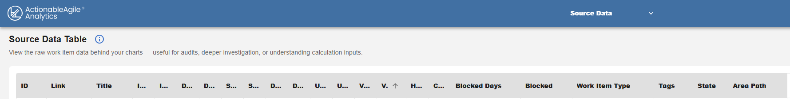

# AAExport - ActionableAgile Analytics Exporter

**AAExport** is a PowerShell utility that extracts historical flow metrics from [Azure DevOps Boards](https://azure.microsoft.com/en-us/products/devops/boards) and formats them for direct import into [ActionableAgile Analytics](https://www.55degrees.se/products/actionableagileanalytics).

This tool bridges the gap for users with a standalone SaaS license for ActionableAgile who cannot use the integrated Azure DevOps extension. It generates a JSON matrix file compliant with the ActionableAgile import schema, handling complex history replay, split columns, and hierarchy mapping automatically.

## Features
* **Incremental Updates:** Drastically reduces runtime by comparing the live `Changed Date` against your local file, fetching history only for modified items.
* **Split Column Support:** Automatically detects "Doing/Done" split columns and exports them as separate stages (e.g., `Develop` and `Develop Done`).
* **Blocked Days:** Calculates the total days an item was flagged as "Blocked", excluding same-day blocks (e.g., Blocked 9am -> Unblocked 3pm = 0 days).
* **Tag Formatting:** Automatically converts Azure DevOps tags to the `[Tag1|Tag2]` format required by ActionableAgile.
* **History Replay:** Reconstructs the exact date an item entered a column, correctly handling items that skipped columns or moved rapidly.
* **Hierarchy Extraction:** Can explode the Area Path into 7 distinct levels (`Area Level 1-7`) and extract the leaf `Node Name` for detailed filtering.
* **Data Sanitization:** Optional `-FixDecreasingDates` switch to auto-correct "backward movement" timestamps that break flow analytics.

## Output
The exported file is in `` json `` format, as this provides more consistency with regards to dates than `` csv `` files.

The export contains the following fields by default, and additional fields may be added using the `` -AdditionalFields `` parameter described below.

| ID | Link | Title | Work Item Type | Tags | Changed Date | ... Board columns ... | Blocked Days | Blocked | State | Area Path |
| :--- | :--- | :--- | :--- | :--- | :--- | :--- | :--- | :--- | :--- | :--- |
...

#### Example


## Performance & Compatibility
This script is designed to run in restricted corporate environments where PowerShell is often the only available runtime. It automatically detects your PowerShell version to optimize performance.

| Version | Execution Mode | Performance Note |
| :--- | :--- | :--- |
| **PowerShell 7+** | **Parallel** | **High Speed.** Spawns multiple threads (default: 8) to fetch work item history concurrently. Recommended for large datasets. |
| **PowerShell 5.1** | **Sequential** | **Standard Speed.** Fetches items one by one. Fully compatible with standard corporate Windows builds where PS 7 is unavailable. |

## Usage
The script is controlled entirely via command-line arguments.

### Core Connection
| Parameter | Type | Required | Description |
| :--- | :--- | :--- | :--- |
| `-Org` | String | Yes | Your Azure DevOps Organization name (e.g., `mycompany`). |
| `-Project` | String | Yes | The Project name (e.g., `myproject`). |
| `-Team` | String | Yes | The specific Team name that owns the board (e.g., `"myteam"`). |
| `-Pat` | String | Yes | A Personal Access Token with **Read** access to Work Items. |

### Board Configuration
| Parameter | Type | Required | Description |
| :--- | :--- | :--- | :--- |
| `-Board` | String | Yes | The exact name of the Kanban board to export (e.g., `"Features"`). |
| `-WorkItemTypes` | String[] | No | Comma-separated list of types to include. Defaults to the board's backlog category if omitted. |
| `-AreaPaths` | String[] | No | Filter by specific Area Paths. If omitted, defaults to the Team's configured Area Paths. <br> **Note:** Supports sub-areas automatically. |

### Output & Logic
| Parameter | Type | Required | Description |
| :--- | :--- | :--- | :--- |
| `-Output` | Path | Yes | The destination path for the JSON file (e.g., `./export.json`). |
| `-IncrementalUpdate`| Switch | No | Enables smart delta updates. Reads the existing output file and only fetches history for items that have a newer `Changed Date` on the server. |
| `-HistoryLimit` | Int | No | Max number of most recent items to fetch. Default is `1000`. |
| `-FixDecreasingDates`| Switch | No | If set, clears timestamps that appear chronologically *earlier* than a previous column (fixes "backward movement" data errors). |
| `-ThrottleLimit` | Int | No | (PS 7+ only) Number of concurrent threads. Default is `8`. |

### Custom Fields (`-AdditionalFields`)
You can extract extra fields using the `-AdditionalFields` parameter. This supports both standard field mapping and special keywords.

* **Format:** `"Friendly Name=Reference.Name"`
* **Keywords:**
    * `NodeName`: Extracts the leaf node of the Area Path.
    * `AreaHierarchy`: Explodes the Area Path into `Area Level 1` through `Area Level 7` columns.

---

## Examples

### 1. Running from the Command Line (Terminal)
You can run the script directly from a PowerShell terminal. Use backticks `` ` `` to split the command across multiple lines for readability.

```powershell
.\AAExport.ps1 `
  -Org "mycompany" `
  -Project "myproject" `
  -Team "myteam" `
  -Board "Features Board" `
  -WorkItemTypes "Feature" `
  -AreaPaths "myproject\myarea" `
  -AdditionalFields "Parent=System.Parent", "Value Area=Microsoft.VSTS.Common.ValueArea", "AreaHierarchy", "NodeName" `
  -FixDecreasingDates `
  -IncrementalUpdate `
  -Output ".\export.json" `
  -Pat "YOUR_PERSONAL_ACCESS_TOKEN"