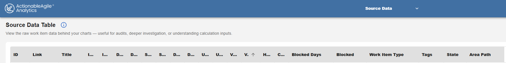

# AAExport - ActionableAgile Analytics Exporter

**AAExport** is a PowerShell utility that extracts historical flow metrics from [Azure DevOps Boards](https://azure.microsoft.com/en-us/products/devops/boards) and formats them for direct import into [ActionableAgile Analytics](https://www.55degrees.se/products/actionableagileanalytics) or for general reporting.

This tool bridges the gap for users with a standalone SaaS license for ActionableAgile who cannot use the integrated Azure DevOps extension. It generates a compliant data matrix, automatically handling complex history replay, split columns, cross-team WEF fields, and hierarchy mapping.

## Features
* **Multi-Format Export:** Export your data natively to ActionableAgile JSON Matrix (`json`), standard Comma-Separated Values (`csv`), or native Microsoft Excel workbooks (`excel`).
* **Strict Schema Compliance:** The exported data is strictly ordered (`ID, Link, Title -> Workflow Steps -> Metadata`) and dates are sanitized (`yyyy-MM-dd`) to guarantee flawless import into ActionableAgile.
* **Incremental Updates:** Drastically reduces runtime by comparing the live `Changed Date` against your local file (supports both `.json` and `.csv` baselines), fetching history only for modified items.
* **Robust ADO State Anchoring:** Automatically resolves cross-team board columns (WEF fields) and uses live state anchoring to catch items closed via PR merges or direct API calls that bypass standard drag-and-drop events.
* **Split Column Support:** Automatically detects "Doing/Done" split columns and exports them as separate stages (e.g., `Develop` and `Develop Done`).
* **Blocked Days Calculation:** Calculates the total days an item was flagged as "Blocked", excluding same-day blocks.
* **Hierarchy Extraction:** Can explode the Area Path into 7 distinct levels (`Area Level 1-7`) and extract the leaf `Node Name` for detailed filtering.
* **Data Sanitization:** Optional `-FixDecreasingDates` switch to auto-correct "backward movement" timestamps that break cumulative flow diagrams.

## Output Structure
The export strictly aligns with ActionableAgile's required column ordering. Additional fields specified via `-AdditionalFields` will be appended to the metadata section.

| ID | Link | Title | ... Board columns ... | Work Item Type | Tags | Changed Date | State | Area Path | Blocked | Blocked Days |
| :--- | :--- | :--- | :--- | :--- | :--- | :--- | :--- | :--- | :--- | :--- |
...

#### Example


## Performance & Compatibility
This script is designed to run in restricted corporate environments where PowerShell is often the only available runtime.

| Version | Execution Mode | Performance Note |
| :--- | :--- | :--- |
| **PowerShell 7+** | **Parallel** | **High Speed.** Spawns multiple threads (default: 8) to fetch work item history concurrently. Recommended for large datasets. |
| **PowerShell 5.1** | **Sequential** | **Standard Speed.** Fetches items one by one. Fully compatible with standard corporate Windows builds. |

*Note on Excel format:* The `-Format excel` option utilizes the Windows Excel COM Object. If Microsoft Excel is not installed on the machine running the script, it will safely fall back to generating a standard CSV file.

## Usage
The script is controlled entirely via command-line arguments.

### Core Connection
| Parameter | Type | Required | Description |
| :--- | :--- | :--- | :--- |
| `-Org` | String | Yes | Your Azure DevOps Organization name (e.g., `mycompany`). |
| `-Project` | String | Yes | The Project name (e.g., `myproject`). |
| `-Team` | String | Yes | The specific Team name that owns the board (e.g., `"myteam"`). |
| `-Pat` | String | Yes | A Personal Access Token with **Read** access to Work Items. |

### Board Configuration
| Parameter | Type | Required | Description |
| :--- | :--- | :--- | :--- |
| `-Board` | String | Yes | The exact name of the Kanban board to export (e.g., `"Features"`). |
| `-WorkItemTypes` | String[] | No | Comma-separated list of types to include. Defaults to the board's backlog category if omitted. |
| `-AreaPaths` | String[] | No | Filter by specific Area Paths. If omitted, defaults to the Team's configured Area Paths. <br> **Note:** Supports sub-areas automatically. |

### Output & Logic
| Parameter | Type | Required | Description |
| :--- | :--- | :--- | :--- |
| `-Output` | Path | Yes | The destination path for the file (e.g., `./export.json`). |
| `-Format` | String | No | Format of the exported file: `json` (default), `csv`, or `excel`. ActionableAgile imports require `json` or `csv`. |
| `-IncrementalUpdate`| Switch | No | Enables smart delta updates. Reads the existing output file and only fetches history for items with a newer `Changed Date`. *(Supports `.json` and `.csv` files).* |
| `-HistoryLimit` | Int | No | Max number of most recent items to fetch. Default is `1000`. |
| `-FixDecreasingDates`| Switch | No | If set, clears timestamps that appear chronologically *earlier* than a previous column (fixes "backward movement" data errors). |
| `-ThrottleLimit` | Int | No | (PS 7+ only) Number of concurrent threads. Default is `8`. |

### Custom Fields (`-AdditionalFields`)
You can extract extra fields using the `-AdditionalFields` parameter. This supports both standard field mapping and special keywords. Dates are automatically sanitized to `yyyy-MM-dd`.

* **Format:** `"Friendly Name=Reference.Name"`
* **Keywords:**
    * `NodeName`: Extracts the leaf node of the Area Path.
    * `AreaHierarchy`: Explodes the Area Path into `Area Level 1` through `Area Level 7` columns.

---

## Examples

### 1. Running from the Command Line (Terminal)
You can run the script directly from a PowerShell terminal. Use backticks `` ` `` to split the command across multiple lines for readability.

```powershell
.\AAExport.ps1 `
  -Org "mycompany" `
  -Project "myproject" `
  -Team "myteam" `
  -Board "Features Board" `
  -WorkItemTypes "Feature" `
  -AreaPaths "myproject\myarea" `
  -AdditionalFields "Parent=System.Parent", "Value Area=Microsoft.VSTS.Common.ValueArea", "AreaHierarchy", "NodeName" `
  -FixDecreasingDates `
  -IncrementalUpdate `
  -Format "excel" `
  -Output ".\export.xlsx" `
  -Pat "YOUR_PERSONAL_ACCESS_TOKEN"
```
### 2. Running via VS Code (launch.json)
If you prefer debugging inside VS Code, add this configuration to your `` .vscode/launch.json ``.

Note: Arguments containing spaces must be wrapped in escaped quotes `` \" ``.

```json 
{
    "version": "0.2.0",
    "configurations": [
        {
            "name": "Run AAExport",
            "type": "PowerShell",
            "request": "launch",
            "script": "${workspaceFolder}/AAExport.ps1",
            "args": [
                "-Org", "mycompany",
                "-Project", "myproject",
                "-Team", "\"myteam\"",
                "-Board", "\"Features Board\"",
                "-WorkItemTypes", "Feature",
                "-AreaPaths", "\"myproject\\myarea\"",
                
                // Custom Field Configuration
                "-AdditionalFields", 
                    "Parent=System.Parent", 
                    "\"Value Area=Microsoft.VSTS.Common.ValueArea\"", 
                    "AreaHierarchy", 
                    "NodeName",
        
                "-FixDecreasingDates",
                "-Output", "${workspaceFolder}/export.json",
                "-Pat", "${env:ADO_PAT}"
            ]
        }
    ]
}
```